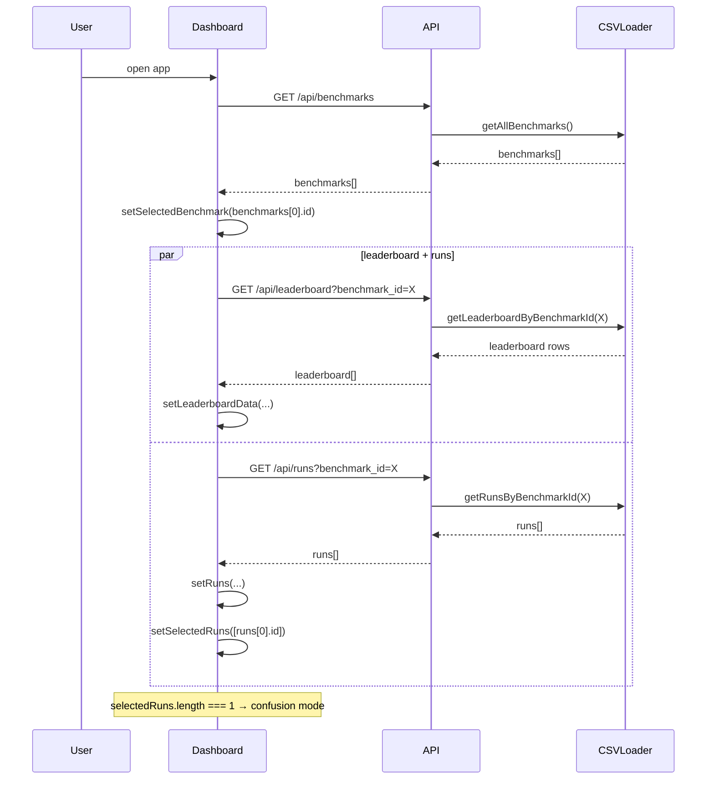
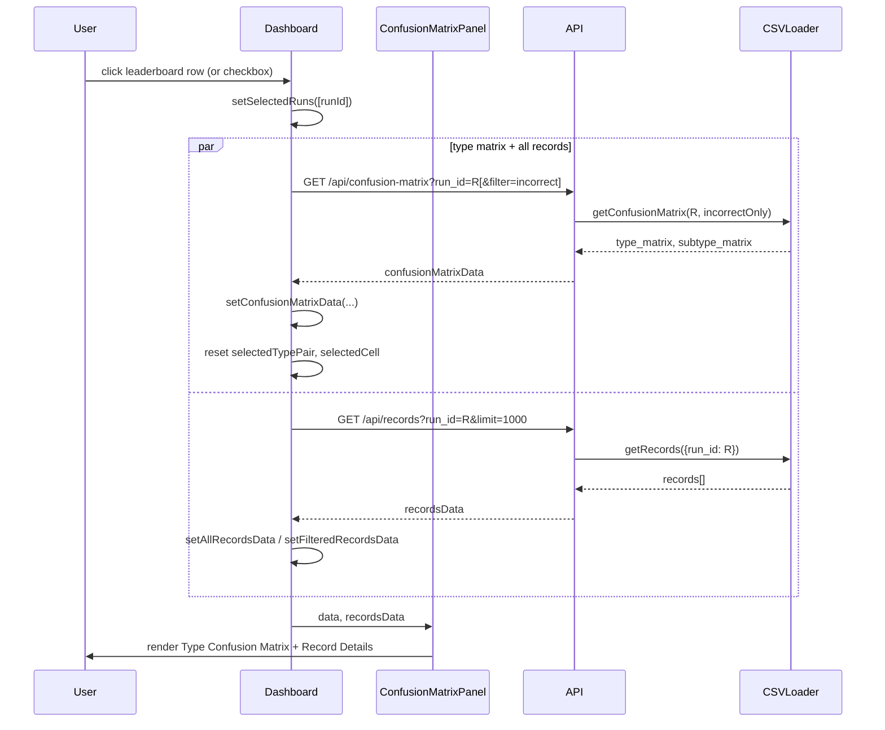
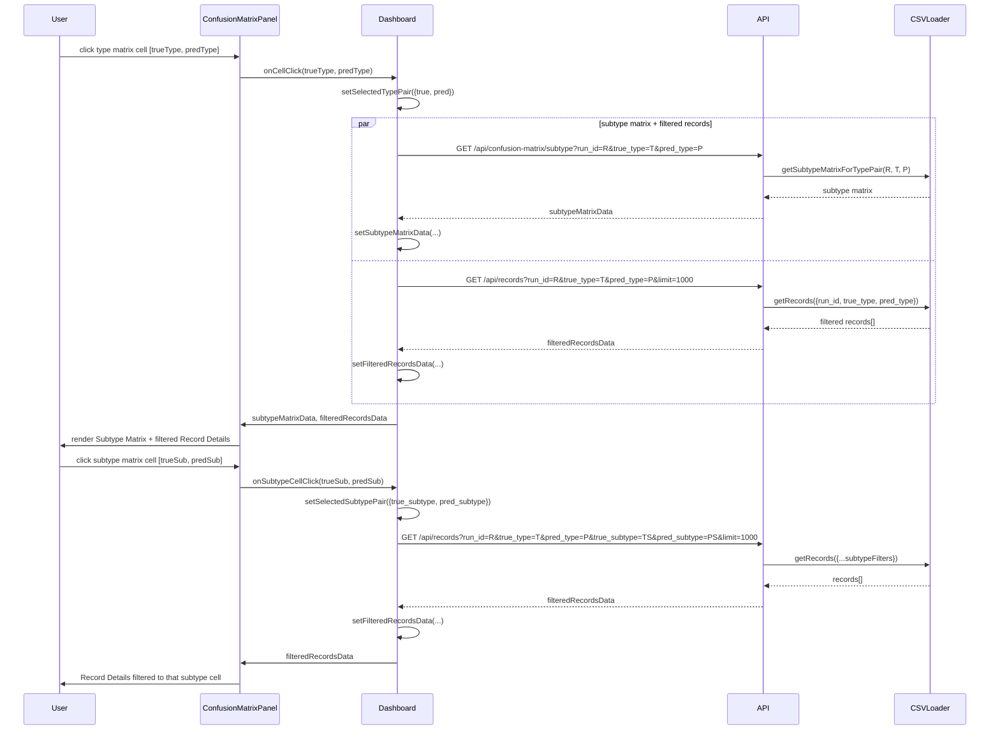
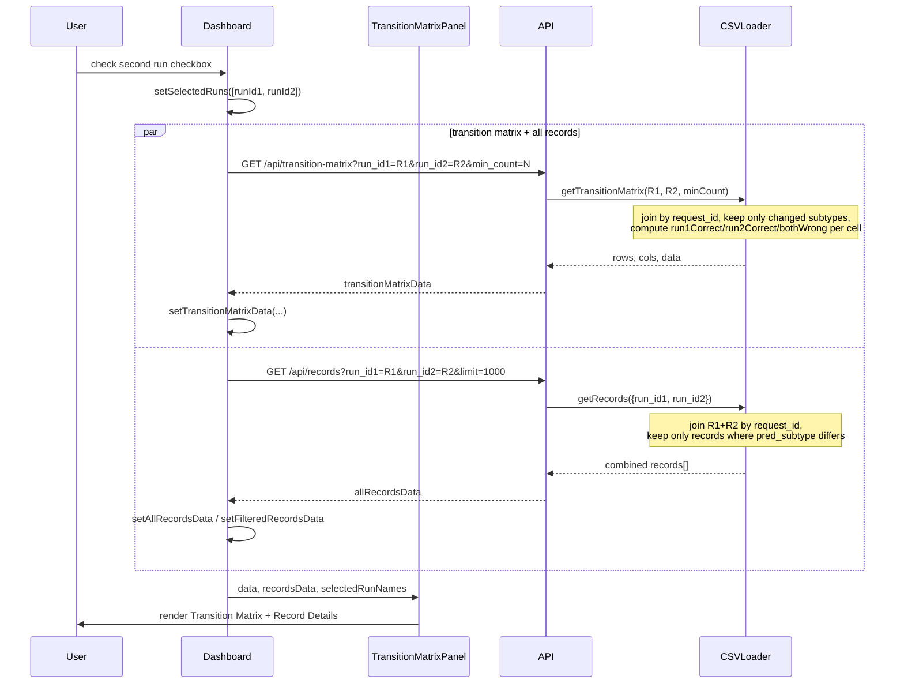
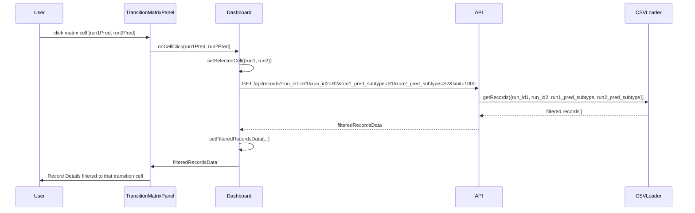
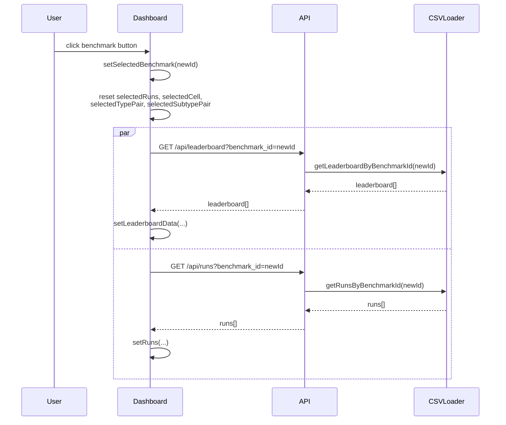
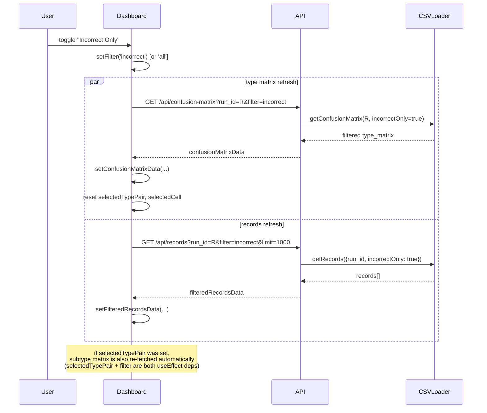

# Application Flow

Sequence diagrams for the main interaction flows in the React/Node version.

Participants:

* **User** — browser interactions
* **Dashboard** — `Dashboard.jsx`, owns all state and `useEffect` hooks
* **API** — Express routes in `server/api/`
* **CSVLoader** — `server/csv-loader.js`, in-memory data cache

---

## 1. App Initialisation

Runs once on mount. Benchmarks are fetched, then the first benchmark is auto-selected, triggering the leaderboard and runs fetches in parallel.

---

## 2. Confusion Mode — Single Run Selected

Triggered whenever `selectedRuns` changes to exactly one run, or the `filter` toggle changes.

---

## 3. Confusion Mode — Drill Down (Type → Subtype → Records)

---

## 4. Transition Mode — Two Runs Selected

Triggered when `selectedRuns.length === 2`.

---

## 5. Transition Mode — Cell Click Filters Records

---

## 6. Benchmark Switch

Resets all analysis state and restarts from the leaderboard.

---

## 7. Incorrect-Only Filter Toggle

Only available in confusion mode. Refreshes the type matrix, subtype matrix (if a type pair is selected), and records.

