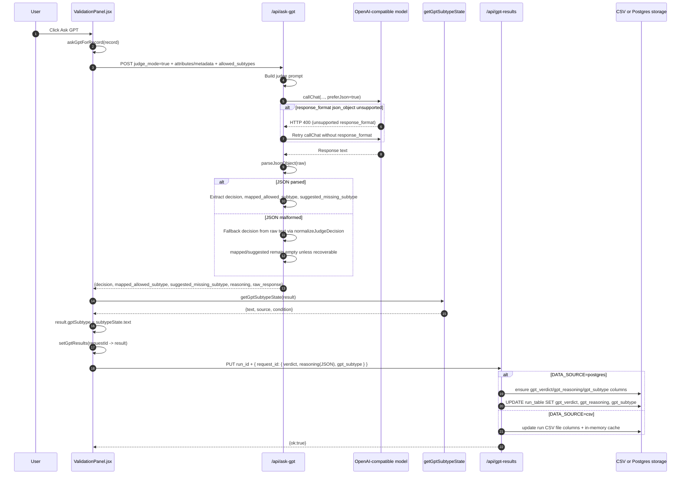

# Updating GPT Subtype

This document explains the exact runtime path from pressing Ask GPT in the UI until gpt_subtype is computed, shown in UI, and persisted.

## Scope

Flow covered:
- Frontend click path in ValidationPanel
- Backend ask-gpt judge response path
- Frontend subtype derivation path
- Persistence path in gpt-results API
- CSV and Postgres storage behavior

## End-to-End Sequence

## Frontend Trigger Path

Entry point:
- askGptForRecord(record, { quick }) in ValidationPanel

Main steps:
1. Compute predictedStatus from record.pred_subtype_2.
2. Build request payload:
   - judge_mode: true
   - attributes, metadata
   - predicted_status, pred_type, pred_subtype, stage2_subtype
   - candidate_subtype, missing_subtype
   - allowed_subtypes (empty list in quick mode)
3. POST to /api/ask-gpt.
4. Map backend response to local result object.
5. Call getGptSubtypeState(result) to derive subtype text.
6. Set result.gptSubtype to returned text.
7. Update UI state with setGptResults.
8. Persist to /api/gpt-results with:
   - verdict (legacy yes/no mapping)
   - reasoning (structured JSON string)
   - gpt_subtype (derived subtype text)

## Backend Judge Path

Route:
- POST /api/ask-gpt with judge_mode=true

Main logic:
1. Compose system/user prompts.
2. callChat with preferJson=true.
3. If JSON mode rejected (400 + response_format/json_object unsupported), retry without JSON mode.
4. Parse LLM output with resilient parser pipeline:
   - strict JSON.parse
   - markdown fence stripping
   - first JSON object extraction
   - lightweight repair (quotes, trailing commas)
5. If parse still fails:
   - do not hard-fail
   - normalize decision from raw text via normalizeJudgeDecision
6. Normalize mapped subtype:
   - accept only if present in allowed_subtypes set (case-insensitive)
   - otherwise discard mapped value
7. Extract suggested missing subtype using priority keys:
   - suggested_missing_subtype
   - suggested_label
   - suggested_subtype
   - suggetsed_missing_subtype (typo support)
   - sugested_missing_subtype (typo support)
8. Return payload to frontend.

## gpt_subtype Derivation Conditions

Function:
- getGptSubtypeState(result)

Priority order (first match wins):

1. No result
- Condition: result is null/undefined
- Output: text="", source="none", condition="no-result"

2. Error result
- Condition: result.error is truthy
- Output: text="ENUM_ERROR", source="error", condition="error"

3. Persisted real subtype already exists
- Condition: result.gptSubtype non-empty and does not start with ENUM_
- Output: that persisted subtype
- Condition label: persisted-gpt-subtype

4. mapped_allowed_subtype is exactly unknown
- Condition: mappedAllowedSubtype lowercased equals unknown
- Output: text="unknown", source="truly-unknown", condition="mapped-unknown"

5. mapped_allowed_subtype is non-empty
- Condition: mappedAllowedSubtype non-empty
- Output: mapped subtype string
- Condition label: mapped

6. suggested_missing_subtype is non-empty
- Condition: suggestedMissingSubtype non-empty
- Output: suggested subtype string
- Condition label: suggested-missing-subtype

7. decision is truly_unknown
- Condition: normalizeDecision(decision || subtype) equals truly_unknown
- Output: text="unknown", source="truly-unknown", condition="truly-unknown"

8. Persisted ENUM placeholder exists
- Condition: result.gptSubtype starts with ENUM_ and no better signal above
- Output: persisted ENUM text
- Condition label: persisted-enum-placeholder

9. No decision
- Condition: decision empty
- Output: ENUM_NO_DECISION

10. missing_but_mappable without mapped target
- Condition: decision == missing_but_mappable and mapped empty
- Output: ENUM_MAPPABLE_WITHOUT_ALLOWED

11. true_missing_subtype without suggestion
- Condition: decision == true_missing_subtype and suggested empty
- Output: ENUM_MISSING_WITHOUT_SUGGESTION

12. wrong_subtype without mapped target
- Condition: decision == wrong_subtype and mapped empty
- Output: ENUM_WRONG_WITHOUT_TARGET

13. Any other decision string
- Condition: fallback
- Output: ENUM_EMPTY_<DECISION_UPPERCASE>

Important detail:
- mapped/suggested checks intentionally happen before decision==truly_unknown.
- So if mapped_allowed_subtype has a concrete value, it wins and gpt_subtype is updated to that value.

## Persistence Path

After deriving gptSubtype:
1. Frontend sets local state immediately.
2. Frontend persists via PUT /api/gpt-results.
3. Payload includes gpt_subtype explicitly.

Backend handling:
- Postgres mode:
  - Ensures columns exist: gpt_verdict, gpt_reasoning, gpt_subtype
  - Updates per-run table row by request id column (request_id or record_id)
- CSV mode:
  - Ensures CSV headers include gpt_verdict, gpt_reasoning, gpt_subtype
  - Writes updated CSV file
  - Updates in-memory cache

## Reload Path (How subtype is restored)

On run load, frontend fetches /api/gpt-results and calls normalizeGptResult per row.

normalizeGptResult source priority:
- gptSubtype from value.gpt_subtype, then parsedReasoning.gpt_subtype
- mappedAllowedSubtype from value.mapped_allowed_subtype, then parsedReasoning.mapped_allowed_subtype
- suggestedMissingSubtype from multiple keys including typo variants

Then getGptSubtypeState runs again using the same condition order above.

## Why gpt_subtype might not become a concrete label

Expected non-concrete outcomes:
- result.error exists -> ENUM_ERROR
- decision missing -> ENUM_NO_DECISION
- missing_but_mappable with empty mapped subtype -> ENUM_MAPPABLE_WITHOUT_ALLOWED
- true_missing_subtype with empty suggested subtype -> ENUM_MISSING_WITHOUT_SUGGESTION
- wrong_subtype with empty mapped subtype -> ENUM_WRONG_WITHOUT_TARGET
- unrecognized decision -> ENUM_EMPTY_<DECISION>

These are intentional fallback states that explain why no concrete subtype was produced.
